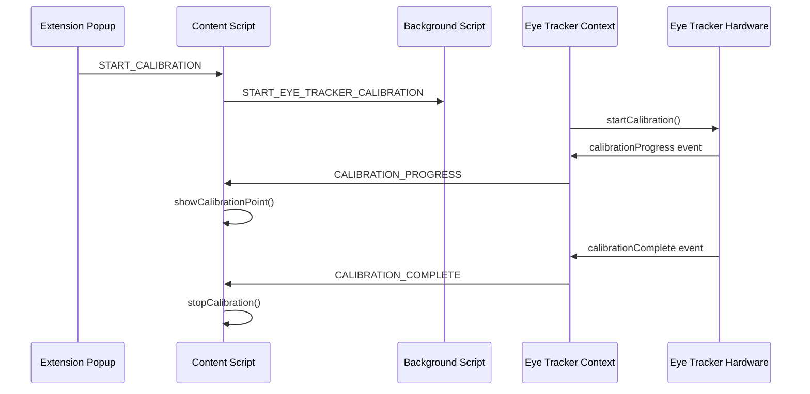

# 🎯 Full-Screen Calibration Implementation

## Problem with Popup Calibration

The original implementation tried to show calibration UI inside the extension popup, which is incorrect because:
- ❌ **Small Area**: Popup is too small for proper calibration
- ❌ **Wrong Context**: Calibration needs to cover the actual browser page
- ❌ **Poor UX**: Users can't see calibration points properly
- ❌ **Inaccurate**: Eye tracking calibration requires full-screen coverage

## Solution: Full-Screen Overlay

Implemented proper full-screen calibration that overlays the entire browser page, similar to the emotion experiment approach.

### ✅ How It Works

#### 1. **Trigger from Popup**
```typescript
// In popup/pages/eye-tracking.tsx
const handleStartCalibration = async () => {
  // Send message to content script to start full-screen calibration
  const tabs = await chrome.tabs.query({ active: true, currentWindow: true })
  if (tabs[0]?.id) {
    chrome.tabs.sendMessage(tabs[0].id, {
      type: 'START_CALIBRATION'
    })
  }
}
```

#### 2. **Full-Screen Overlay in Content Script**
```typescript
// In contents/unified-overlay.ts
function startCalibration() {
  // Create full-screen calibration overlay
  calibrationOverlay = document.createElement('div')
  calibrationOverlay.style.cssText = `
    position: fixed !important;
    top: 0 !important;
    left: 0 !important;
    width: 100vw !important;
    height: 100vh !important;
    background: #1f2937 !important;
    z-index: 2147483650 !important;
    // ... full-screen styling
  `
  
  document.body.appendChild(calibrationOverlay)
  showCalibrationPoint(0)
}
```

#### 3. **Calibration Points Display**
```typescript
function showCalibrationPoint(pointIndex: number) {
  const point = calibrationPoints[pointIndex]
  const pointElement = document.createElement('div')
  pointElement.style.cssText = `
    position: absolute !important;
    width: 20px !important;
    height: 20px !important;
    border-radius: 50% !important;
    background: #4CAF50 !important;
    border: 3px solid white !important;
    left: ${point.x * 100}% !important;
    top: ${point.y * 100}% !important;
    animation: calibrationPulse 1s infinite alternate !important;
  `
  calibrationOverlay.appendChild(pointElement)
}
```

#### 4. **Eye Tracker Integration**
```typescript
// In contexts/EyeTrackerContext.tsx
tracker.on('calibrationProgress', (progress) => {
  // Forward progress to content script for UI updates
  chrome.tabs.sendMessage(tabId, {
    type: 'CALIBRATION_PROGRESS',
    current: progress.current,
    total: progress.total
  })
})
```

### 🎯 Calibration Flow

1. **User clicks "Start Calibration"** in popup
2. **Popup sends message** to content script
3. **Content script creates** full-screen overlay
4. **Content script requests** eye tracker to start calibration
5. **Eye tracker sends** calibration events
6. **Context forwards events** to content script
7. **Content script updates** calibration point display
8. **Calibration completes** and overlay is removed

### 📊 Calibration Points

The calibration uses **5 points** in standard positions:
```typescript
const calibrationPoints = [
  { x: 0.1, y: 0.1 },  // Top-left (10%, 10%)
  { x: 0.9, y: 0.1 },  // Top-right (90%, 10%)
  { x: 0.5, y: 0.5 },  // Center (50%, 50%)
  { x: 0.1, y: 0.9 },  // Bottom-left (10%, 90%)
  { x: 0.9, y: 0.9 }   // Bottom-right (90%, 90%)
]
```

### 🎨 Visual Design

- **Background**: Dark gray (`#1f2937`) to reduce distractions
- **Points**: Green (`#4CAF50`) with white border for visibility
- **Animation**: Pulsing effect to draw attention
- **Instructions**: Clear text at top of screen
- **Progress**: "Point X of 5" indicator
- **Z-Index**: `2147483650` to ensure it's on top of everything

### 🔄 Message Flow



### 🎮 User Experience

1. **Click "Start Calibration"** in popup
2. **Full-screen overlay appears** on the current page
3. **Clear instructions** shown at top
4. **Green calibration points** appear one by one
5. **Progress indicator** shows "Point X of 5"
6. **Automatic progression** through all 5 points
7. **Overlay disappears** when calibration completes

### 🔍 Benefits

- ✅ **Full-Screen Coverage**: Calibration covers entire browser viewport
- ✅ **Proper Eye Tracking**: Accurate calibration across full screen area
- ✅ **Clear Visual Cues**: Large, animated calibration points
- ✅ **User Guidance**: Clear instructions and progress indicators
- ✅ **Non-Intrusive**: Overlay only appears during calibration
- ✅ **Cross-Page**: Works on any website the user is viewing

### 📋 Testing

1. **Load extension** in Chrome
2. **Navigate to any webpage**
3. **Connect eye tracker** via popup
4. **Click "Start Calibration"** in popup
5. **Full-screen overlay should appear** on the webpage
6. **Follow the calibration points** as they appear
7. **Overlay should disappear** when complete

## Status: ✅ IMPLEMENTED

The calibration UI now properly renders as a full-screen overlay on the actual browser page, providing accurate calibration for the entire viewing area.
